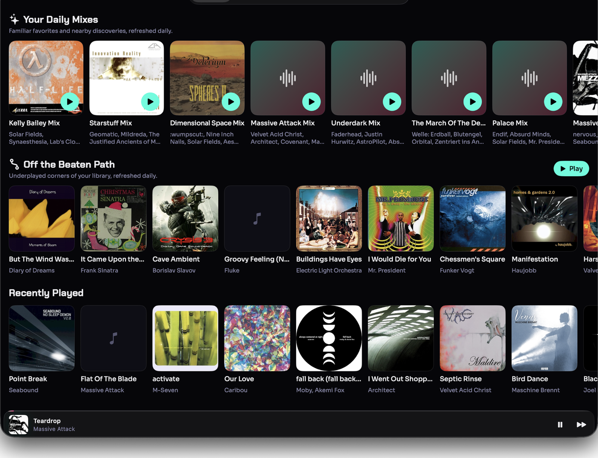
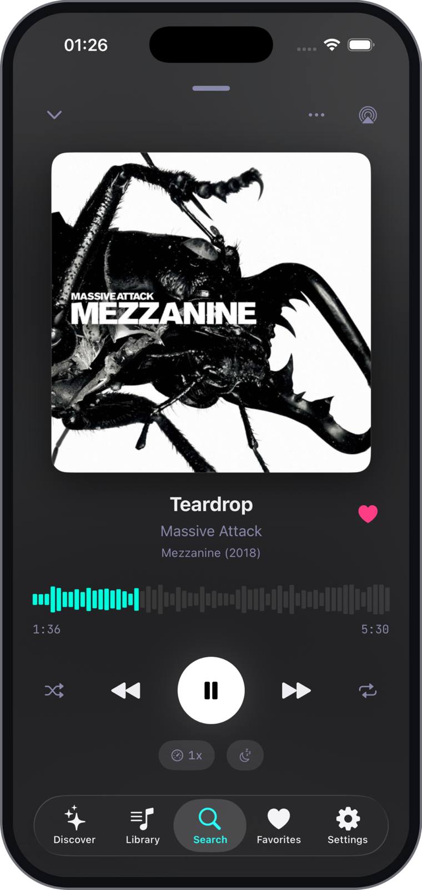

# Aurelia

A modern music streaming client for Jellyfin servers, built for iOS, macOS, and Apple Watch.


## Screenshots

<p align="center">
  
  &nbsp;&nbsp;&nbsp;&nbsp;
  
</p>

## Features

### iOS App
- 🎵 **Gapless Playback** - Seamless transitions between tracks using AVQueuePlayer
- 🔐 **Quick Connect** - Easy authentication with Jellyfin servers
- 🎨 **Cypherpunk Design** - Modern UI with iOS 26 Liquid Glass effects
- 🎧 **Background Audio** - Full lock screen controls and Control Center integration
- 📱 **AirPlay Support** - Stream to any AirPlay-enabled device
- 🔀 **Queue Management** - Drag-to-reorder, shuffle, and repeat modes
- ⭐ **Favorites** - Mark your favorite artists, albums, and tracks
- 🔍 **Search** - Find music across your entire library
- 📅 **Year Filtering** - Browse artists and albums by release year

### Apple Watch App
- ⌚ **Standalone Streaming** - Stream music directly from Jellyfin over cellular/WiFi
- 👤 **Artist-First Navigation** - Browse your library by artist with year filters
- 🎵 **Now Playing** - Full playback controls on your wrist
- 📡 **Auto-Sync** - Credentials automatically sync from your iPhone

### macOS App
- 🖥️ **Mac Catalyst** - The complete iPhone music experience in a resizable Mac window
- 🎛️ **System Media Controls** - Control playback from Control Center and supported keyboards
- 💾 **Offline Downloads** - Keep albums and tracks available on your Mac

## Technology

- **SwiftUI** - Modern declarative UI framework
- **Combine** - Reactive state management
- **SQLite + GRDB** - Indexed, transactional local library metadata and user-state cache
- **AVFoundation** - High-quality audio playback with gapless support
- **Keychain** - Secure credential storage
- **WatchConnectivity** - Seamless iPhone ↔ Watch credential sync
- **MediaPlayer** - Lock screen and Control Center integration

## Requirements

- iOS 17.0+ / macOS 14.0+ / watchOS 10.0+
- Xcode 15.0+
- A running Jellyfin server
- Jellyfin server with Quick Connect enabled (recommended)

## Installation

### TestFlight (Recommended)
*Coming soon!* Aurelia will be available for beta testing via TestFlight.

### Building from Source
1. Clone this repository
2. Open `Aurelia.xcodeproj` in Xcode
3. Select your development team in the project settings
4. Build and run on your iPhone, Apple Watch, or Mac

For macOS, select the shared `Aurelia macOS` scheme and the `My Mac (Mac Catalyst)` destination. Make sure your Apple Developer account is signed in under Xcode Settings > Accounts and Automatic Signing is enabled for the `Aurelia` target. Xcode may ask to create a Mac Catalyst development provisioning profile for the app's bundle identifier the first time you run it.

You can also verify compilation with an unsigned local build from Terminal:

```bash
xcodebuild -project Aurelia.xcodeproj \
  -scheme "Aurelia macOS" \
  -destination "platform=macOS,variant=Mac Catalyst" \
  -derivedDataPath /tmp/AureliaDerived \
  CODE_SIGNING_ALLOWED=NO build
```

The unsigned artifact is for compile verification only. macOS can launch its linker-signed executable, but Keychain access is unavailable without a development provisioning profile, so it cannot securely retain Jellyfin credentials.

```bash
cd Aurelia
open Aurelia.xcodeproj
```

## Usage

### First Launch
1. Open Aurelia on your iPhone
2. Choose **Quick Connect** or **Manual Setup**
3. Enter your Jellyfin server details
4. Start streaming!

### Apple Watch
The watch app automatically syncs credentials from your iPhone. Just open Aurelia on your watch and start browsing your library.

## Architecture

Aurelia uses a service-oriented architecture with singleton services:

- **JellyfinService** - API client for all Jellyfin server communication
- **LibraryRepository** - transactional GRDB/SQLite catalog used by every library UI
- **LibrarySyncCoordinator** - timestamp deltas, foreground event invalidation, and periodic deletion reconciliation
- **PlayerManager** - Audio playback engine with gapless queue management
- **KeychainService** - Secure credential storage
- **WatchConnectivityManager** - iPhone ↔ Watch communication

The first sign-in imports the complete music catalog. Later foreground and
pull-to-refresh syncs request only metadata and user-state changes since the
last committed watermark. A periodic lightweight ID inventory reconciles
deletions, and **Settings → Rebuild Local Library** remains available for
explicit recovery. Sync progress is shown without blocking cached browsing.

See [CLAUDE.md](CLAUDE.md) for detailed development documentation.

## Privacy

Aurelia is a local-first app. Your credentials and data stay on your devices. We don't collect anything. We don't have servers. It's just you and your Jellyfin server.

Read our full [Privacy Policy](PRIVACY_POLICY.md).

## Contributing

Contributions are welcome! Please feel free to submit a Pull Request.

## License

Aurelia is available under the MIT license. See the LICENSE file for more info.

## Credits

Aurelia began as a fork of [JellyAmp](https://github.com/satsdisco/JellyAmp) and
owes its foundation to that project and its contributors. The name is the genus
of the moon jellyfish — a nod to the Jellyfin server it speaks to.

## Acknowledgments

- Built for the [Jellyfin](https://jellyfin.org/) community
- Inspired by modern music players and cypherpunk aesthetics
- Uses Jellyfin's open API for seamless media streaming

## Support

For questions, issues, or feature requests:
- Check the [Jellyfin documentation](https://jellyfin.org/docs/)

---

**Made with 🎵 for Jellyfin users who love great design**
